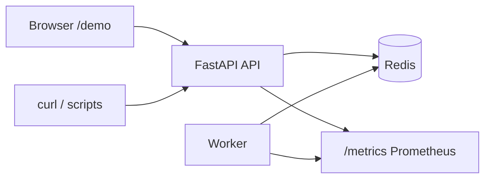

# ForgeQueue

Fault-tolerant **Redis-backed job queue** with a FastAPI control plane, a Python worker, **exponential backoff retries**, **visibility timeouts + heartbeats** (crash recovery without double-running long jobs), a **dead-letter queue (DLQ)** with manual replay, **idempotency** and **content deduplication**, structured logging, and **Prometheus** metrics. The reliability properties are covered by an explicit **pytest** matrix (see [`tests/README.md`](tests/README.md)).

[](https://github.com/Adamvalade/forgequeue/actions/workflows/ci.yml)
[](https://render.com/deploy?repo=https://github.com/Adamvalade/forgequeue)

## Deploy (for recruiters — no clone required)

Production-style hosting needs **three** pieces: **Redis**, the **API** (`api/Dockerfile`, listens on `PORT`), and the **worker** (`worker/Dockerfile`). This repo includes a **[Render Blueprint](https://render.com/docs/blueprint-spec)** at [`render.yaml`](render.yaml): the API and worker are on **Starter** so the public demo **does not cold-start** after idle (free web tiers on Render spin down; bad for recruiter links). Use the **Deploy to Render** button above (connect GitHub, apply the blueprint), then share:

`https://<your-service>.onrender.com/demo/`

Details, TLS Redis notes, and alternatives (Railway, Fly, VPS) are in [`docs/DEPLOY.md`](docs/DEPLOY.md).

## Why this is useful on a resume

You can honestly say you built a **distributed systems-shaped** project: at-least-once delivery with safe retries, lease-based claiming, recovery of in-flight work, operational endpoints (`/health`, `/ready`, `/metrics`), and automated tests that encode acceptance criteria. That maps cleanly to how real queues and async workers are reasoned about in production.

## Architecture



- **API**: static **demo UI** at `/demo/`, enqueue jobs, read status, stats, DLQ, retry from DLQ, export metrics.
- **Worker**: `BRPOP` queue, visibility lease + heartbeat, delayed retry ZSET, recovery pass for expired in-flight work, DLQ on exhaustion.

## Quick start

**Hosted (best for sharing):** deploy with Render (button at top) and send people to **`/demo/`** on your public URL.

**Local:**

1. `docker compose up --build`
2. Open **[http://localhost:8000/demo/](http://localhost:8000/demo/)** — live stats, one-click sample jobs, job JSON, DLQ retry.

Other useful paths: [`/docs`](http://localhost:8000/docs), [`/metrics`](http://localhost:8000/metrics), [`/`](http://localhost:8000/).

## Terminal demo (optional)

```bash
./scripts/demo.sh
```

`API_URL=http://localhost:8000 ./scripts/demo.sh` if you need a non-default host. Same scenarios as the web UI, for screen recordings that show the shell.

## Tests

```bash
docker compose run --rm --build tests
```

Or with services already up:

```bash
docker compose run --rm tests pytest tests/ -v
```

## Tech stack

Python 3.12, FastAPI, Redis, Docker Compose, Prometheus client, pytest, requests; demo UI is static HTML/JS served from the API (no Node build step).
