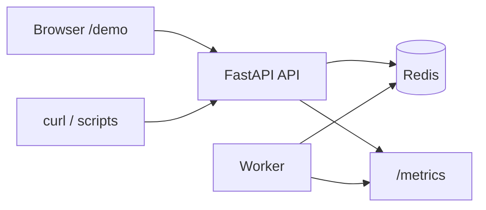

# ForgeQueue
## What is this?

ForgeQueue is a fault-tolerant distributed job queue designed to simulate real-world backend failure scenarios.

The live demo showcases:
- Automatic retry with exponential backoff
- Worker crash recovery via visibility timeouts + heartbeats
- Dead-letter queue handling after repeated failure
- Idempotent processing to prevent duplicate execution

Try it here: https://forgequeue-api.onrender.com/demo/

Redis-backed job queue: FastAPI control plane, Python worker, retries with backoff, visibility timeouts and heartbeats, dead-letter queue with replay, idempotency keys and short-lived deduplication, structured logs, Prometheus `/metrics`. Reliability scenarios are covered in [`tests/README.md`](tests/README.md).

[](https://github.com/Adamvalade/forgequeue/actions/workflows/ci.yml)
[](https://render.com/deploy?repo=https://github.com/Adamvalade/forgequeue)

## Deploy

Three services: **Redis**, **API** (`api/Dockerfile`, bind **`PORT`**), **worker** (`worker/Dockerfile`). [`render.yaml`](render.yaml) wires them on Render (Starter web + worker to avoid idle spin-down). Live UI: **`https://<host>/demo/`**. See [`docs/DEPLOY.md`](docs/DEPLOY.md) for TLS Redis and other hosts.

Optional: set **`FORGEQUEUE_GITHUB_URL`** on the API service so the demo page links to your fork.

## Architecture



## Run locally

```bash
docker compose up --build
```

- Demo UI: [http://localhost:8000/demo/](http://localhost:8000/demo/)
- OpenAPI: [http://localhost:8000/docs](http://localhost:8000/docs)
- Ops JSON: [`/`](http://localhost:8000/), [`/system`](http://localhost:8000/system), [`/metrics`](http://localhost:8000/metrics)

```bash
./scripts/demo.sh
```

## Tests

```bash
docker compose run --rm --build tests
```

With stack already up: `docker compose run --rm tests pytest tests/ -v`

## Stack

Python 3.12, FastAPI, Redis, Docker Compose, Prometheus client, pytest.
